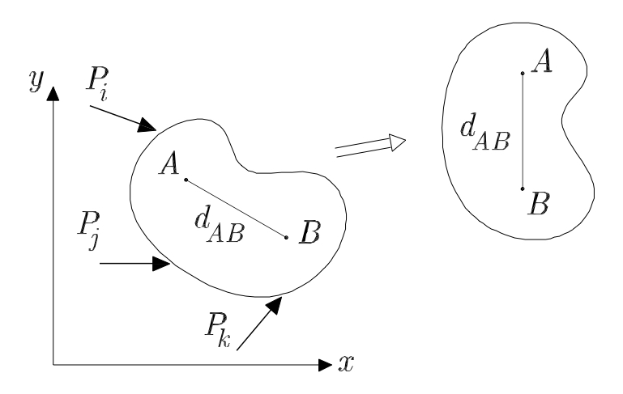
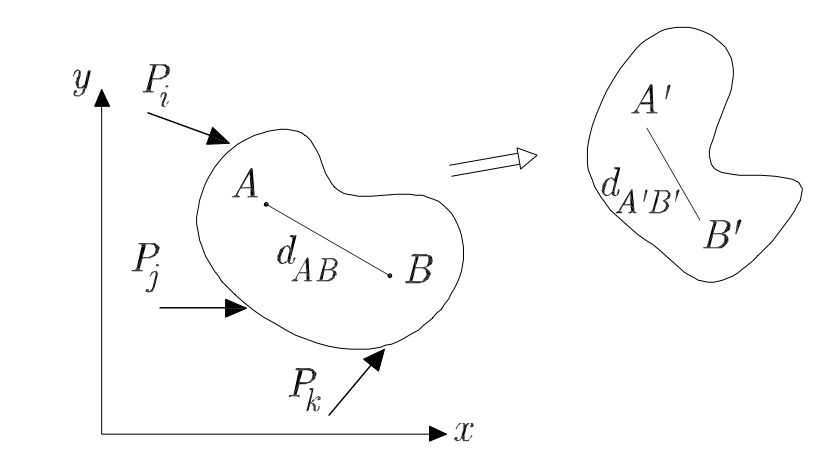
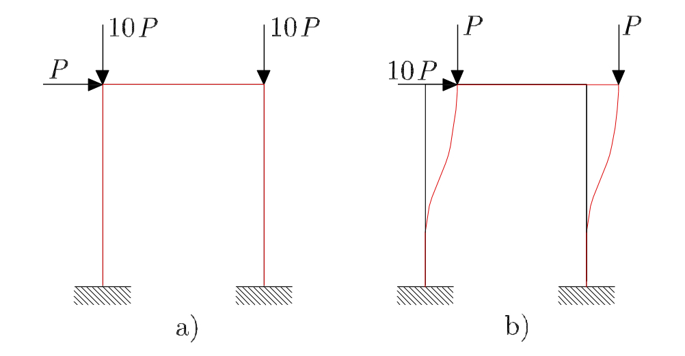
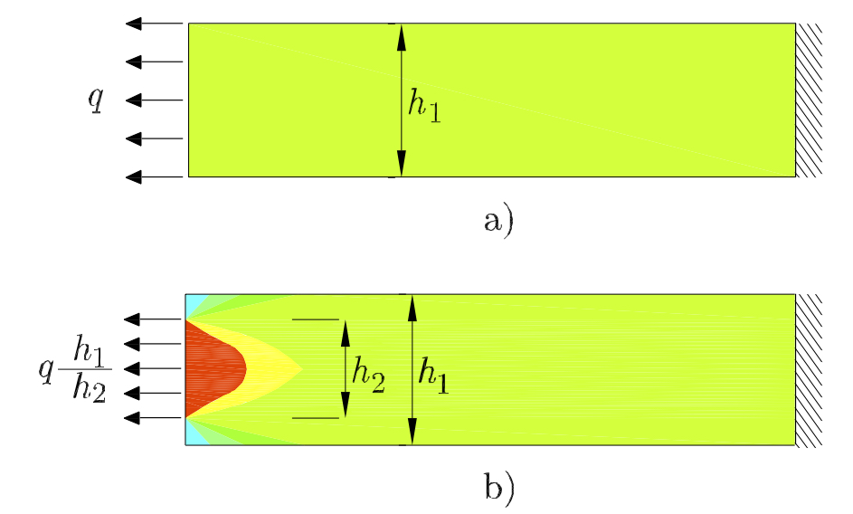
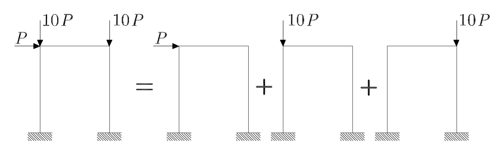
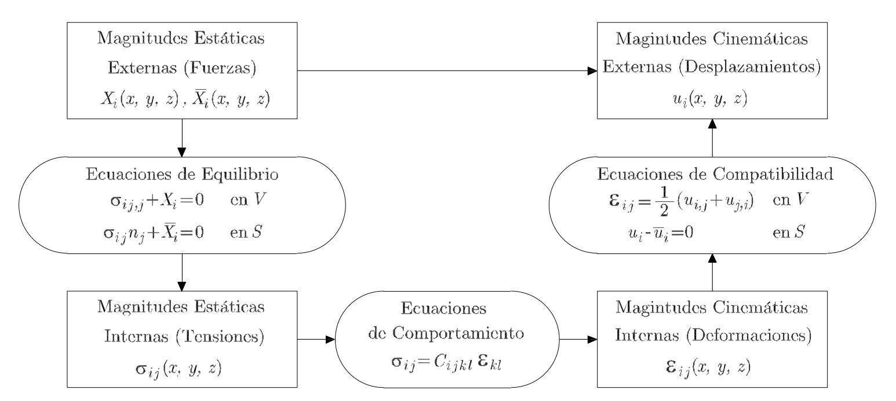

Introduccíon a la Elasticidad y Resistencia de Materiales
=========================================================

.. Mecánica del Sólido Rígido y Mecánica del Sólido Deformable:

Mecánica del Sólido Rígido y Mecánica del Sólido Deformable
___________________________________________________________

La Mecánica, que proviene de la palabra *mechanica* en latín que significa arte de construir una máquina, es la rama
de la física que estudia y analiza el movimiento y reposo de los cuerpos, y su evolución en el tiempo, bajo la acción de fuerzas.
Las hipótesis básicas de la Mecánica de sólidos se enumeran a continuación:

#. Se consideran las ecuaciones de la Mecánica de Newton
#. El sólido es un medio continuo
#. Se cumplen las leyes básicas de la Termodinámica (conservación de la energía y producción de entropía)

La segunda hipótesis implica que el sólido no tiene discontinuidades a nivel microscópico como
consecuencia de la distribución molecular de cada material.
Es decir, se ignora la existencia de estructuras a nivel microscópico (moleculares, atómicas, cristalinas
o granulares), considerando que el comportamiento a nivel macroscópico es independiente de tal estructura
(salvo a través de relaciones experimentales que se traducen en la relación de comportamiento).
Esta hipótesis se justifica por las pequeñas dimensiones de los constituyentes microscópicos
(moléculas, cristales o granos) en comparación con las dimensiones significativas del sólido
(distribución de los apoyos o de las cargas y dimensiones propias del sólido)
y permite trabajar con un espacio continuo y utilizar las herramientas que proporciona el análisis diferencial.

Sólido Rígido
^^^^^^^^^^^^^

Si un sólido sometido a un conjunto de fuerzas alcanza el equilibrio sin sufrir modificaciones de su forma original,
o dichas modificaciones son despreciables respecto a su movimiento, se denomina Sólido Rígido.
Un Sólido Rígido se caracteriza por una distribución continua de la materia y por la invariabilidad
de las distancias relativas entre cualesquiera de los puntos que lo constituyen.
Las ecuaciones de la estática, de la cinemática y de la dinámica son suficientes para definir el comportamiento de
este tipo de sólidos.

.. _solidorigido:

   Sólido Rígido

La :numref:`solidorigido` muestra un sólido con una forma genérica al que se aplica
un sistema de fuerzas.
Como consecuencia de las fuerzas aplicadas el sólido se traslada y gira sin deformarse, es decir,
se comporta como un Sólido Rígido.

Sólido Deformable
^^^^^^^^^^^^^^^^^

Si un sólido sometido a un conjunto de fuerzas alcanza el equilibrio produciéndose modificaciones
en su forma original, debemos adoptar el modelo de Sólido Deformable.
Dicho modelo considera una distribución continua de la materia, así como la variación, también continua,
de las distancias entre cualesquiera de los puntos que lo constituyen.
Para establecer las ecuaciones generales que gobiernan el comportamiento mecánico de los sólidos deformables,
es necesario complementar las ecuaciones de la estática, cinemática y dinámica con ecuaciones que relacionen
las modificaciones de forma del sólido con las fuerzas que se producen en el interior del mismo debidas
a este cambio de forma.

.. _solidodeformabl:

   Sólido Deformable

La :numref:`solidodeformabl` muestra un sólido con una forma genérica al que se aplica un sistema fuerzas.
Como consecuencia de las fuerzas aplicadas el sólido se traslada, gira y deforma, es decir, se comporta como un Sólido Deformable.

Hipótesis básicas de la Elasticidad y de la Resistencia de Materiales
_____________________________________________________________________

La cinemática y dinámica de sólidos deformables queda definida mediante la imposición de las hipótesis
básicas establecidas en la :numref:`Mecánica del Sólido Rígido y Mecánica del Sólido Deformable`. Dichas hipótesis dejan el campo de estudio del sólido deformable
muy abierto, por lo que se suele acotar estableciendo hipótesis adicionales.
Una simplificación al problema general del sólido deformable consiste en plantear el comportamiento
del mismo como lineal, lo que implica asumir tres hipótesis adicionales:

#. Pequeños desplazamientos

#. Pequeñas deformaciones

#. Comportamiento elástico y lineal del material

Pequeños desplazamientos
^^^^^^^^^^^^^^^^^^^^^^^^

La hipótesis de pequeños desplazamientos implica que los desplazamientos del sólido son tan pequeños
que las ecuaciones de equilibrio pueden plantearse, sin error apreciable, en la posición inicial.

.. _pequeñosdespla:

   Hipótesis de pequeños desplazamientos

En la :numref:`pequeñosdespla` se muestra un pórtico sometido a dos sistemas de fuerzas y la deformada debida
a cada uno de estos sistemas de fuerzas. El comportamiento de la estructura de la :numref:`pequeñosdespla` a)
frente al sistema de cargas actuante puede considerarse dentro de la hipótesis de pequeños
desplazamientos. La deformada coincide prácticamente con la configuración inicial del pórtico.
En la estructura de la :numref:`pequeñosdespla` b) la configuración deformada de la estructura difiere sustancialmente de la configuración
inicial. Por tanto, no es correcto plantear las ecuaciones de equilibrio en la configuración anterior
a la aplicación del sistema de cargas, ya que los resultados obtenidos no tendrían en cuenta los
grandes desplazamientos que ha sufrido la estructura.

Pequeñas deformaciones
^^^^^^^^^^^^^^^^^^^^^^

La hipótesis de pequeñas deformaciones supone que las derivadas de los desplazamientos son despreciables frente a la unidad,
y los productos de derivadas son despreciables frente a las propias derivadas. Esto implica que las deformaciones se expresen como
combinación lineal de las derivadas primeras de los desplazamientos. Por ejemplo
:math:`\epsilon_{ij}=\frac{1}{2}\left ( \frac{\partial u_i}{\partial x_j}+\frac{\partial u_j}{\partial x_i} \right )` siendo :math:`\epsilon_{ij}`
la deformación, y :math:`u_i` y :math:`u_j` los desplazamientos.

Comportamiento elástico y lineal del material
^^^^^^^^^^^^^^^^^^^^^^^^^^^^^^^^^^^^^^^^^^^^^

En todo punto de un sólido de un determinado material existe una relación entre las tensiones y las deformaciones
en dicho punto al someter al sólido a un sistema cualesquiera de cargas.
Si el sólido recupera su forma inicial al cesar la aplicación de las cargas, se dice que el material tiene un comportamiento elástico.
Si además, la relación entre tensiones y deformaciones es lineal, se dice que el material tiene un comportamiento elástico y lineal.

Las tres hipótesis anteriores son necesarias y suficientes para considerar el sólido deformable como elástico y lineal.
Además de las tres hipótesis anteriores, en el estudio de la Elasticidad Lineal y de la Resistencia de Materiales,
se suponen estas otras hipótesis:

* Principio de Saint-Venant
* El material es homogéneo
* El material es isótropo
* El problema es estático
* El problema es isotermo

Principio de Saint-Venant
^^^^^^^^^^^^^^^^^^^^^^^^^

El Principio de Saint-Venant establece que sistemas estáticamente equivalentes producen los mismos efectos.

.. _SaintVenant:

   Principio de Saint-Venant

La :numref:`SaintVenant` muestra dos placas rectangulares, de idénticas dimensiones, que se encuentran empotradas en un extremo y sometidas a
una carga uniformemente distribuida en el otro. En la placa de la :numref:`SaintVenant` a), la carga se distribuye uniformemente en la dimensión
h1, mientras que en la placa de la :numref:`SaintVenant` b) la carga se distribuye uniformemente sobre la dimensón h2.

En ambos casos la resultante de la distribución de fuerzas aplicadas sobre cada placa es qh1. Además, la distribución de tensiones
normales en la dirección de la carga se ha representado sobre la superficie de cada placa, mostrando como se transmite la carga
hasta el apoyo en cada una de las placas. Para la placa que se muestra en la :numref:`SaintVenant` a) podemos observar como la carga se
transmite hasta el apoyo de forma uniforme. Sin embargo, en el caso de la placa que se muestra en la :numref:`SaintVenant` b), se advierte
una alteración en la distribución de las tensiones normales hasta una cierta distancia de la zona de aplicación de la carga,
a partir de la cual la carga se transmite hasta el apoyo de forma uniforme, como en el caso de la placa que se muestra en
la :numref:`SaintVenant` a). Podemos concluir que la aplicación de la carga en un tramo limitado puede considerarse como una discontinuidad
que provoca alteraciones en la transmisión de la carga. No obstante, a una distancia suficientemente alejada de la zona de aplicación,
dicha discontinuidad no tiene afecto alguno.

Material homogéneo
^^^^^^^^^^^^^^^^^^

Considerar el material homogéneo significa que todos los puntos del mismo son iguales a efectos de comportamiento mecánico.
Matemáticamente implica que la relación de comportamiento (relación entre tensiones y deformaciones) es similar en cualquier
punto del material, y por tanto es independiente de las coordenadas del punto estudiado.

Material isótropo
^^^^^^^^^^^^^^^^^

Un material isótropo es aquél cuyo comportamiento mecánico es independiente de la dirección considerada.

Problema estático
^^^^^^^^^^^^^^^^^

Un problema es estático si se considera que los efectos de inercia son despreciables.
Se considera que esto ocurre cuando las cargas exteriores se aplican lentamente, permanecen invariables con el tiempo,
y el sólido tiene impedidos los desplazamientos como sólido rígido que puedan inducir las cargas actuantes.

Problema isotermo
^^^^^^^^^^^^^^^^^

En un problema isotermo no se producen variaciones de la temperatura, o al menos, el efecto de dicha variación es despreciable.

Consecuencias de las hipótesis básicas de la Elasticidad y de la Resistencia de Materiales
^^^^^^^^^^^^^^^^^^^^^^^^^^^^^^^^^^^^^^^^^^^^^^^^^^^^^^^^^^^^^^^^^^^^^^^^^^^^^^^^^^^^^^^^^^

El conjunto de hipótesis anteriores, implica las siguientes consecuencias:

#. Principio de Superposición
#. Existencia y unicidad de la solución

El *Principio de Superposición* supone que hay una relación lineal entre la respuesta estructural y las cargas actuantes.
Esto permite obtener la respuesta de una estructura ante distintas cargas actuando simultáneamente como la suma de la respuesta
de la estructura ante cada una de ellas. Este principio se utiliza para resolver problemas con sistemas de cargas muy complejos
descomponiendo los estados de cargas en otros más simples, cuya solución es conocida o más fácil de obtener.
En la :numref:`superposicion` se muestra una aplicación del Principio de Superposición.

.. _superposicion:

   Principio de Superposición

La segunda consecuencia establece que siempre *existe* una solución a cualquier problema bien definido de mecánica de sólidos,
y que esta solución es *única*.

Modelo matemático para el análisis de Sólidos Deformables. Ecuaciones fundamentales
___________________________________________________________________________________

El objetivo inicial del análisis de Sólidos Deformables consiste en establecer la relación entre las magnitudes estáticas
externas (fuerzas) y las magnitudes cinemáticas externas (desplazamientos).

Para establecer dicha relación, es necesario conocer que ocurre en el interior del
sólido, definiéndose las *magnitudes internas*. Las magnitudes cinemáticas y estáticas internas se relacionan a través de la
ley que modela el comportamiento del material, la cual es independiente de la geometría del sólido y de las condiciones de contorno.
Las magnitudes estáticas externas se relacionan con las magnitudes estáticas internas a través de las ecuaciones de equilibrio.
Mientras que las magnitudes cinemáticas externas se relacionan con las magnitudes cinemáticas internas a través de las ecuaciones
de compatibilidad. De esta manera, se consigue relacionar las acciones externas con los desplazamientos del sólido a través
de las variables internas.

.. _Modelomatematico:

   Modelo matemático para el análisis de sólidos deformables

En la :numref:`Modelomatematico` se muestra esquemáticamente el modelo matemático de análisis.
Generalmente, la formulación matemática de este esquema conduce a ecuaciones de gran complejidad cuya solución analítica
es inabordable. Ello hace que la obtención de soluciones exactas quede restringida a sólidos con geometrías
y cargas muy concretas.