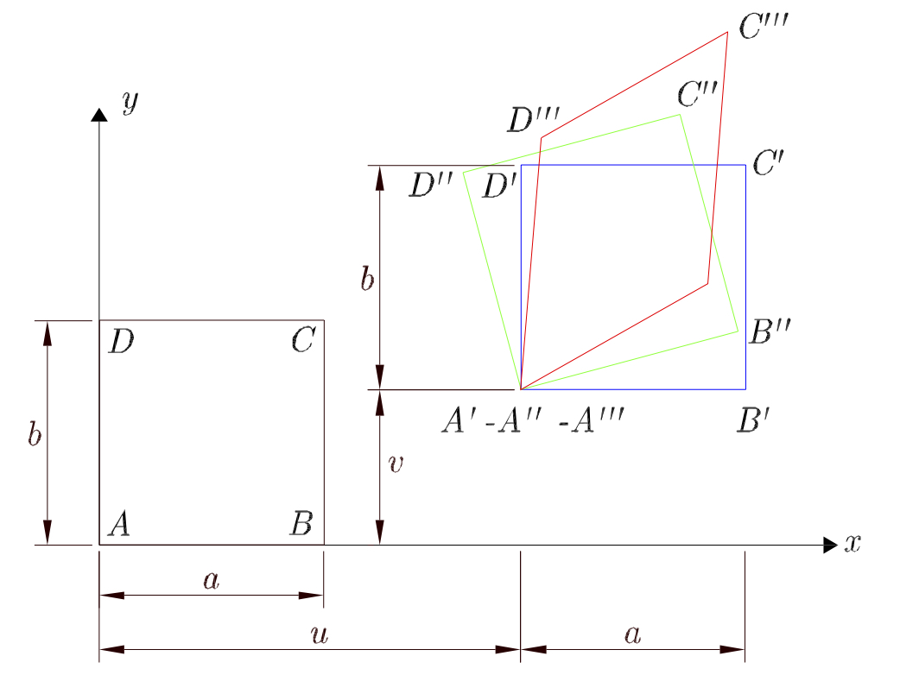
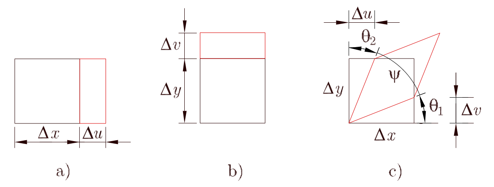
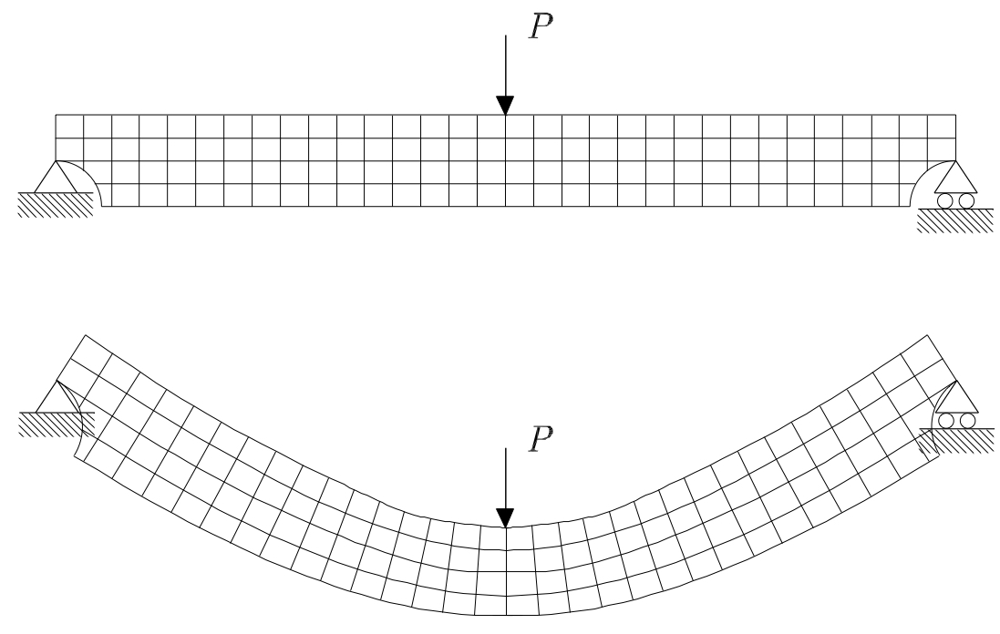
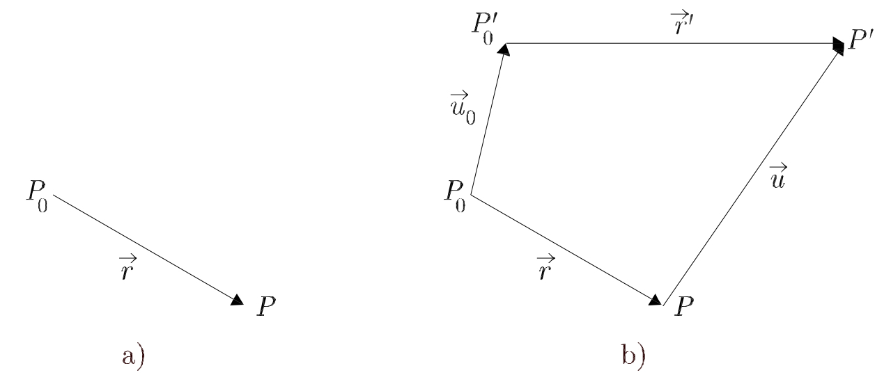
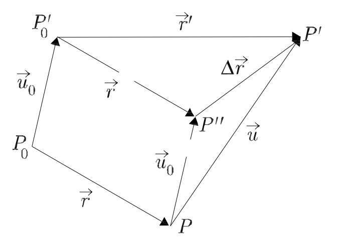
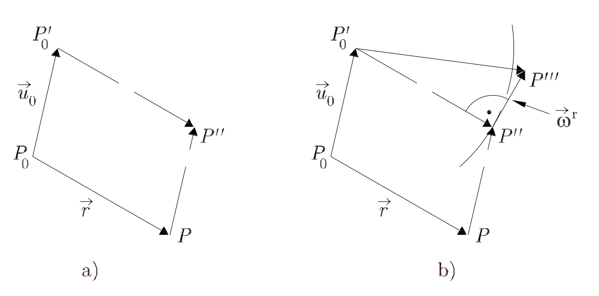
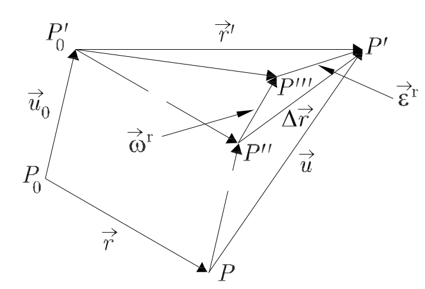

Deformaciones
=============

Concepto de deformación
_______________________

Las partículas que constituyen cualquier sólido real, bajo la acción de cargas que actúan sobre  él,
varían su posición en el espacio. Por consiguiente, el sólido adopta una configuración deformada distinta de la inicial.

.. _Conceptodedeformación:

   Concepto de deformación

Existe deformación en un sólido si se produce un desplazamiento relativo entre las partículas que lo constituyen.
El desplazamiento de los puntos de un sólido es debido a dos componentes: una componente de movimiento como sólido rígido
y otra de deformación. Así pues, el desplazamiento de los puntos de un sólido no implica necesariamente que éste se deforme.
El rectángulo ABCD de la :numref:`Conceptodedeformación` se desplaza hacia otra posición A′B′C′D′, pero es idéntico al inicial;
es decir, no se ha producido ningún acercamiento o separación entre sus partículas, o lo que es lo mismo,
no se ha producido ninguna deformación.

Solamente se ha producido un movimiento como cuerpo rígido. Lo mismo ocurre al pasar a la posición A′′B′′C′′D′′ mediante una rotación
como sólido rígido. Finalmente, cuando el rectángulo pasa a la posición A′′′B′′′C′′′D′′′, sí que se deforma.

Los dos casos m ́as simples de deformación son el alargamiento unitario y la deformación tangencial.
Un ejemplo de estos tipos de deformación se muestra en la :numref:`Ejemplos de deformación`.

.. _Ejemplos de deformación:

   Ejemplos de deformación: a) alargamiento en la dirección "x",
   b) alargamiento en la dirección "y", y c) deformación tangencial pura sin rotación

.. glossary::

   alargamiento unitario

El :term:`alargamiento unitario` se define como un cambio de longitud por unidad de longitud.

Se denomina :math:`\epsilon`, indicando por medio de un subíndice la dirección del alargamiento.
Observando la :numref:`Ejemplos de deformación` a) y la :numref:`Ejemplos de deformación` b), se deduce que

ecuación 2.1

La deformación tangencial se define como la mitad del decremento del ́angulo recto que forman inicialmente dos segmentos
infinitamente pequeños. En referencia a la :numref:`Ejemplos de deformación` c), la expresión de la deformación tangencial es

ecuación 2.2

ecuación 2.3

ecuación 2.4

Para obtener la expresión de la deformación tangencial se han aproximado los ángulos por sus tangentes
(hipótesis de pequeños desplazamientos). El factor 1/2 en la deformación tangencial se debe a que las componentes
de la deformación son las componentes de un tensor de segundo orden simétrico. De la expresión (2.2) se deduce que
la deformación tangencial es positiva si el ángulo pasa a ser agudo.

Deformación en el entorno de un punto
_____________________________________

En la :numref:`Deformación de una viga` se muestra una viga biapoyada sometida a una carga puntual en su zona central,
así como la configuración deformada de la misma.

.. _Deformación de una viga:

   Deformación de una viga biapoyada sometida a una carga puntual

Se aprecia la distorsión que sufre la malla superpuesta sobre la viga una vez deformada.
Los cuadriláteros que forman la malla sufren un alargamiento o acortamiento de los lados que los forman y una variación
de los  ángulos rectos iniciales.
Es decir, la posición relativa entre los puntos del sólido ha variado, por lo que la viga se ha deformado.

Para determinar la deformación producida se va a trabajar con dos puntos cualesquiera P0 y P de la viga, muy próximos,
unidos por el vector de posición :math:`\vec{r}` que se muestra en la :numref:`Deformaciónentornopunto` a).
Al deformarse la viga, los puntos pasan, en la configuración deformada, a las posiciones :math:`P'_0` y :math:`P'` que se
muestran en la :numref:`Deformaciónentornopunto` b).
Considerando la hipótesis de pequeños desplazamientos se admite que las configuraciones deformada e indeformada prácticamente coinciden.

.. _Deformaciónentornopunto:

   Deformación en el entorno de un punto: a) configuración inicial :math:`P'_0` - P y b) configuración final :math:`P'_0` - :math:`P'`

Denominamos vectores desplazamiento de los puntos :math:`P_0` y :math:`P` a :math:`u_0` y :math:`u`, respectivamente.
Al estar muy próximos ambos puntos, es posible obtener el valor de :math:`\vec{u}` utilizando el desarrollo en serie de Taylor
en el entorno del punto :math:`P_0` como sigue,

.. math::
   :label: taylor

   \begin{equation}
    \begin{split}
      u=u_0+\frac{\partial u}{\partial x}r_x+\frac{\partial u}{\partial y}r_y+\frac{\partial u}{\partial z}r_z \\
      v=v_0+\frac{\partial v}{\partial x}r_x+\frac{\partial v}{\partial y}r_y+\frac{\partial v}{\partial z}r_z \\
      w=w_0+\frac{\partial w}{\partial x}r_x+\frac{\partial w}{\partial y}r_y+\frac{\partial w}{\partial z}r_z \\
    \end{split}
   \end{equation}

donde :math:`u`, :math:`v` y :math:`w` son las componentes del desplazamiento en la dirección de los ejes :math:`x`
, :math:`y` y :math:`z`, respectivamente.

.. _Variacióndelvector:

   Variación del vector :math:`r`

Los términos del desarrollo de grado mayor a uno se han despreciado debido a la hipótesis de pequeñas deformaciones.
La variación del vector :math:`\vec{r}` que se muestra en la :numref:`Variacióndelvector` será:

.. math::
   :label: vectorr

   \begin{equation}
   \Delta \vec{r}=\vec{r'}-\vec{r}=\vec{u}-\vec{u_0}
   \end{equation}

Sustituyendo las expresiones :eq:`taylor` y :eq:`vectorr` y desarrollando esta última, se obtiene:

.. math::
   :label: taylor1

   \begin{equation}
    \begin{split}
      \Delta r_x=\frac{\partial u}{\partial x}r_x+\frac{\partial u}{\partial y}r_y+\frac{\partial u}{\partial z}r_z \\
      \Delta r_y=\frac{\partial v}{\partial x}r_x+\frac{\partial v}{\partial y}r_y+\frac{\partial v}{\partial z}r_z \\
      \Delta r_z=\frac{\partial w}{\partial x}r_x+\frac{\partial w}{\partial y}r_y+\frac{\partial w}{\partial z}r_z \\
    \end{split}
   \end{equation}

Expresando :eq:`taylor1` en forma matricial se tiene:

.. math::
   :label: taylor2

   \begin{equation}
    \begin{split}
    \begin{pmatrix}
    \Delta r_x \\
    \Delta r_y \\
    \Delta r_z \\
    \end{pmatrix}=
    \begin{pmatrix}
    \frac{\partial u}{\partial x}&\frac{\partial u}{\partial y}&\frac{\partial u}{\partial z} \\
    \frac{\partial v}{\partial x}&\frac{\partial v}{\partial y}&\frac{\partial v}{\partial z} \\
    \frac{\partial w}{\partial x}&\frac{\partial w}{\partial y}&\frac{\partial w}{\partial z} \\
    \end{pmatrix}
    \begin{pmatrix}
    r_x \\
    r_y \\
    r_z \\
    \end{pmatrix}
    \end{split}
    \end{equation}

o lo que es lo mismo: :math:`\Delta r=J \cdot r`

Donde la "matriz" J se denomina tensor gradiente de desplazamientos.
Dicho tensor se puede descomponer en un tensor simétrico y otro antisimétrico como sigue:

.. math::
   :label: tensordesplazamientos

   \begin{equation}
    J=\epsilon+\omega
   \end{equation}

siendo :math:`\epsilon` es el tensor de pequen ̃as deformaciones, que desarrollando sus componentes
se tiene:

.. math::
   :label: tensordeformaciones1

    \begin{equation}
    \begin{split}
    \epsilon=
    \begin{pmatrix}
    \epsilon_{x}& \epsilon_{xy}& \epsilon_{xz} \\
    \epsilon_{xy}& \epsilon_{y}& \epsilon_{yz} \\
    \epsilon_{xz}& \epsilon_{yz}& \epsilon_{z} \\
    \end{pmatrix}=
    \begin{pmatrix}
    \frac{\partial u}{\partial x}& \frac{1}{2}\left (  \frac{\partial u}{\partial y}+ \frac{\partial v}{\partial x}\right )& \frac{1}{2}\left (  \frac{\partial u}{\partial z}+ \frac{\partial w}{\partial x}\right ) \\
    \frac{1}{2}\left (  \frac{\partial u}{\partial y}+ \frac{\partial v}{\partial x}\right ) &   \frac{\partial v}{\partial y}& \frac{1}{2}\left (  \frac{\partial v}{\partial z}+ \frac{\partial w}{\partial y}\right ) \\
    \frac{1}{2}\left (  \frac{\partial u}{\partial z}+ \frac{\partial x}{\partial y}\right )&\frac{1}{2}\left (  \frac{\partial v}{\partial z}+ \frac{\partial w}{\partial y}\right )&\frac{\partial w}{\partial z} \\
    \end{pmatrix}
    \end{split}
    \end{equation}

y :math:`\omega` es el tensor de rotación, que desarrollado tiene de componentes:

.. math::
   :label: tensorrotacion

    \begin{equation}
    \begin{split}
    \omega=
    \begin{pmatrix}
    0 & \omega_{xy}& \omega_{xz} \\
    -\omega_{xy}& 0 & \omega_{yz} \\
    -\omega_{xz}& \omega_{yz}& 0 \\
    \end{pmatrix}=
    \begin{pmatrix}
    0& \frac{1}{2}\left (  \frac{\partial u}{\partial y}- \frac{\partial v}{\partial x}\right )& \frac{1}{2}\left (  \frac{\partial u}{\partial z}- \frac{\partial w}{\partial x}\right ) \\
    \frac{1}{2}\left (  \frac{\partial u}{\partial y}-\frac{\partial v}{\partial x}\right ) &   0 & \frac{1}{2}\left (  \frac{\partial v}{\partial z}- \frac{\partial w}{\partial y}\right ) \\
    \frac{1}{2}\left (  \frac{\partial u}{\partial z}- \frac{\partial x}{\partial y}\right )&\frac{1}{2}\left (  \frac{\partial v}{\partial z}- \frac{\partial w}{\partial y}\right )& 0\\
    \end{pmatrix}
    \end{split}
    \end{equation}

La expresión :eq:`taylor2` se puede expresar, en forma matricial, teniendo en cuenta :eq:`tensordesplazamientos` como:

.. math::
   :label: desplazamientos1

   \begin{equation}
    \Delta r=(\epsilon+\omega)r=u-u_0
   \end{equation}

que coincide con la expresión :eq:`vectorr`, ésta expresada en forma vectorial.

La ecuación anterior implica que la variación relativa de la distancia entre dos puntos infinitamente próximos
de un sólido elástico se puede expresar sumando a :math:`\vec{u}` una componente de deformación y otra componente de giro.
En forma matricial, puede expresarse como:

.. math::
   :label: desplazamientos2

   \begin{equation}
    u=u_0+\epsilon r+\omega r
   \end{equation}

.. _Deformacion:

   Deformación en el entorno de un punto: a) traslación y b) giro

En la :numref:`Deformacion` a) los puntos  :math:`P_0` y  :math:`P` (vector  :math:`vec{r}` ) han sufrido una traslación como
sólido rígido hasta las posiciones  :math:`P'_0` y  :math:`P''` respectivamente, definida por el vector  :math:`u_0`.

En la :numref:`Deformacion` b)se produce una rotación como sólido rígido del segmento :math:`P_0 P''` alrededor del punto :math:`P'_0`,
de valor :math:`\omega^r` (:math:`\omega r`) (por la hipótesis de pequeños desplazamientos se aproxima
el arco a la tangente).

Finalmente, para pasar a la posición :math:`P'` se produce una deformación del vector :math:`\vec{r}` de valor :math:`\epsilon^r` (:math:`\epsilon r`).
En la :numref:`Deformacion1` se muestra la descomposición completa de la deformación en el entorno de un punto.

.. _Deformacion1:

   Deformación en el entorno de un punto: descomposición

Vector deformación. Componentes intrínsecas
^^^^^^^^^^^^^^^^^^^^^^^^^^^^^^^^^^^^^^^^^^^

En todo punto de un sólido donde esté definido el tensor de pequeñas deformaciones, para cada dirección :math:`\vec{r}`
hay asociado un vector deformación :math:`\vec{\epsilon^r}` que se calcula mediante la expresión matricial:

.. math::
   :label: vectordeformacion

   \begin{equation}
    \begin{split}
    \epsilon^r=\epsilon r=
    \begin{pmatrix}
    \epsilon_{x}& \epsilon_{xy}& \epsilon_{xz} \\
    \epsilon_{xy}& \epsilon_{y}& \epsilon_{yz} \\
    \epsilon_{xz}& \epsilon_{yz}& \epsilon_{z} \\
    \end{pmatrix}
    \begin{pmatrix}
    r_x \\
    r_y \\
    r_z \\
    \end{pmatrix}
    \end{split}
    \end{equation}

Si se utiliza el vector unitario de :math:`\vec{r}` , denominado :math:`\vec{n}` , se obtiene el vector deformación unitaria
:math:`\vec{\epsilon^n}`

.. math::
   :label: vectordeformacionunitaria

   \begin{equation}
    \begin{split}
    \epsilon^n=\epsilon n=
    \begin{pmatrix}
    \epsilon_{x}& \epsilon_{xy}& \epsilon_{xz} \\
    \epsilon_{xy}& \epsilon_{y}& \epsilon_{yz} \\
    \epsilon_{xz}& \epsilon_{yz}& \epsilon_{z} \\
    \end{pmatrix}
    \begin{pmatrix}
    l \\
    m \\
    n \\
    \end{pmatrix}
    \end{split}
    \end{equation}

siendo (l, m, n) los cosenos directores (las componentes) del vector :math:`\vec{n}`.

La componente intrínseca normal, la deformación normal, es la proyección del vector deformación :math:`\vec{\epsilon^n}`
sobre :math:`\vec{n}` . Se obtiene mediante las expresiones:

